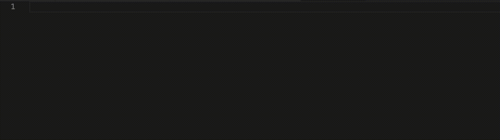
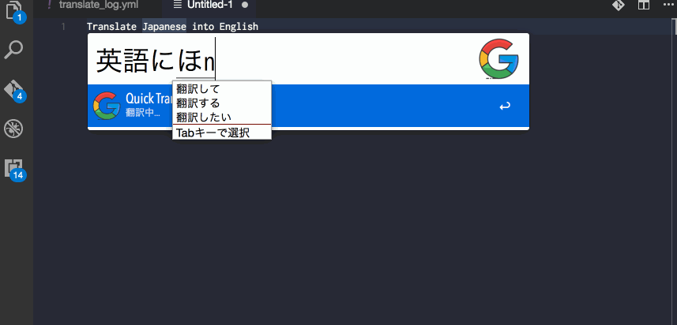
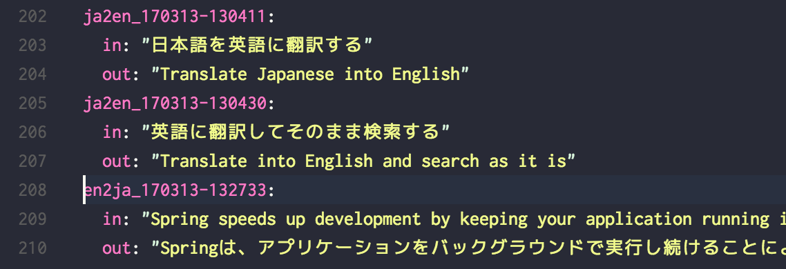
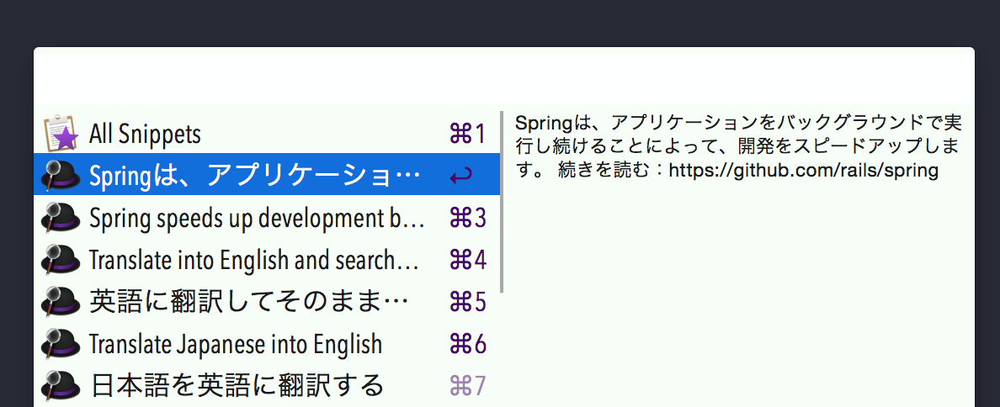
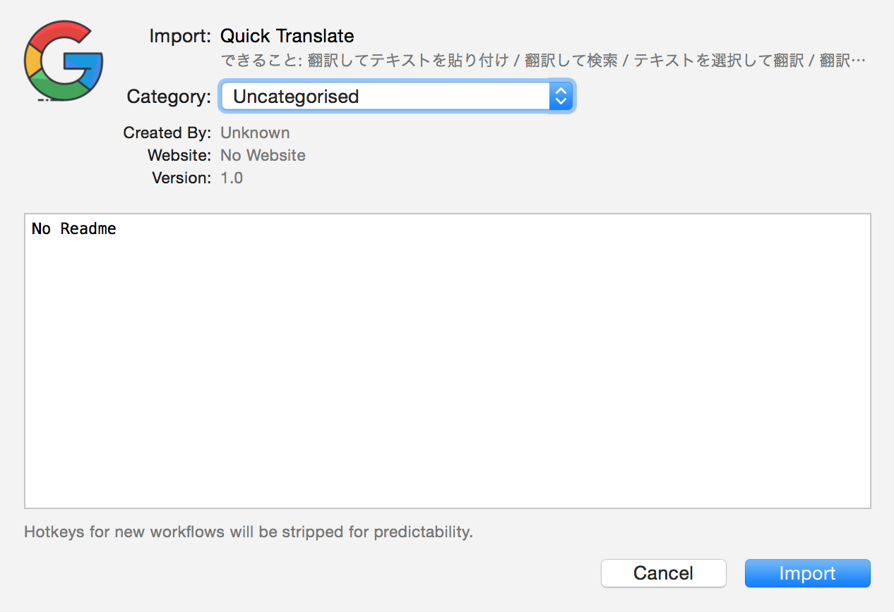
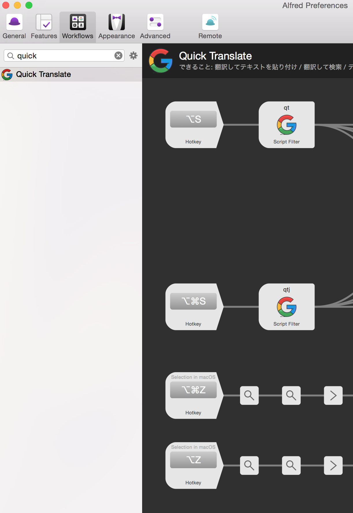
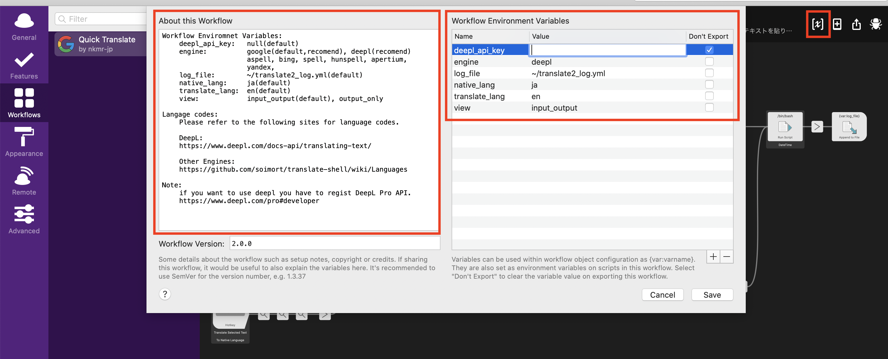

# Alfred Quick Translate
- [Alfred 4](https://www.alfredapp.com/) 対応の翻訳ワークフローです。(※有料のPowerpack が必要です。)
- [translate-shell](https://github.com/soimort/translate-shell) を使っています。
- iconは[iconfinder](https://www.iconfinder.com/icons/1249992/google_media_network_search_social_icon#size=128)で探しました。
- 翻訳エンジンを選択できます。
  - Google(デフォルト), DeepL
  - ※ DeepLを使う場合は [DeepL Pro](https://www.deepl.com/pro#developer) に登録してAPIキーを取得する必要があります。
- 翻訳する言語を選択できるようになりました
  - 言語コード([Google](https://github.com/soimort/translate-shell/wiki/Languages), [DeepL](https://www.deepl.com/docs-api/translating-text/))


## 機能
翻訳してテキストを貼り付け



翻訳してそのまま検索



テキストを選択して翻訳


翻訳したログの自動保存 (`~/translate_log2.yml`)



クリップボードにも自動で保存<br>
Alfredのクリップボード機能を使うと履歴を検索できるので便利です。



どの機能を使っても、翻訳前、翻訳後のテキストは<br>
ログファイルとクリップボードの両方に自動で保存されます。

## インストール

1:  [Alfred](https://www.alfredapp.com/) をインストールし、Powerpackを購入してライセンス認証。

2:  各種コマンドをインストール

```shell
brew install translate-shell jq coreutils curl
```

3: [releases](https://github.com/nkmr-jp/alfred-quick-translate/releases)から`quick-translate.alfredworkflow` をダウンロード

4: ダウンロードした `quick-translate.alfredworkflow` をクリックして開くとAlfredが起動するので`import`をクリック。



## Hotkeyの設定
AlfredのPreferencesのWorkflowsからQuick Translateを開くとこのように各機能のHotkeyが設定できます。<br>
初期の状態ではHotkeyは空白ですのでお好みのキーを割り当てて使ってください。<br>
以下の画像の設定だと。

- `alt + s` : 日本語 → 英語 の翻訳ランチャーが起動
- `alt + cmd + s` : 英語 → 日本語 の翻訳ランチャーが起動
- `alt + cmd + z` : 選択した日本語のテキストを英語に変換する。
- `alt + z` : 選択した英語のテキストを日本語に変換する。

となります。




## 使い方
### サクッと翻訳したい
Hotkeyの設定で割り当てたキーで翻訳ランチャーを起動します。<br>
文字を入力するとリアルタイムで翻訳されます。<br>
`Enter` を押すと、翻訳結果をエディタなどに貼り付けられます。


### 翻訳してGoogleで検索したい
Hotkeyの設定で割り当てたキーで翻訳ランチャーを起動します。<br>
翻訳ランチャーでテキストを入力後<br>
`ctrl + Enter` で翻訳後のテキストでググれます。


### テキストを選択して翻訳したい

翻訳したいテキストを選択して、Hotkeyに割り当てたキーを入力します。


ブラウザだとGoogle翻訳の拡張機能などが使えますが、<br>
たとえばソースコード上の英語コメントやコマンドの`--help` などをすぐ翻訳したいときにも使えて便利です。

## 設定

### DeepL Proに登録してのAPIキーを取得（DeepLを使う場合のみ必要）
以下よりDeepL Proに登録して、APIキーを取得してください。
https://www.deepl.com/pro#developer

### 設定の変更
ワークフローをインストール後、右上のアイコンをクリックすると設定画面が開きます。この画面で翻訳エンジンや言語を選択できます。DeepLを使う場合は、engineに`deepl`と入力して`deepl_api_key`に取得したキーを入力してください。


