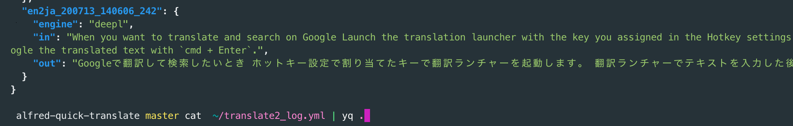
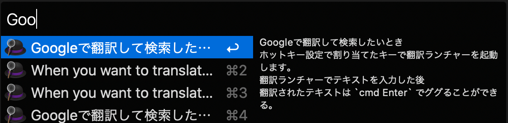
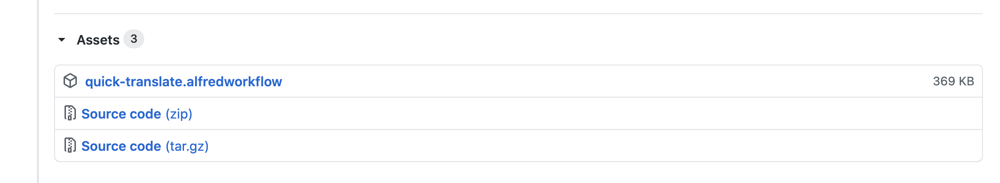
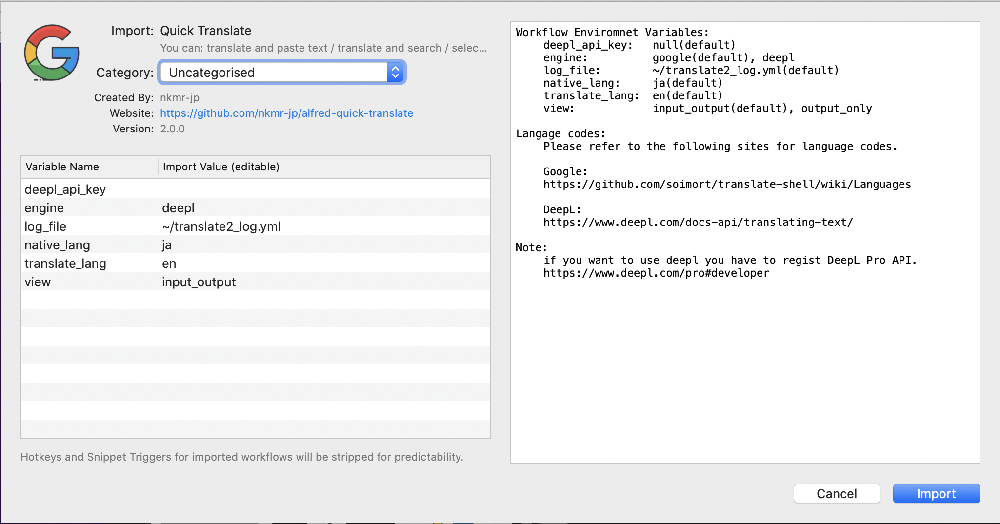
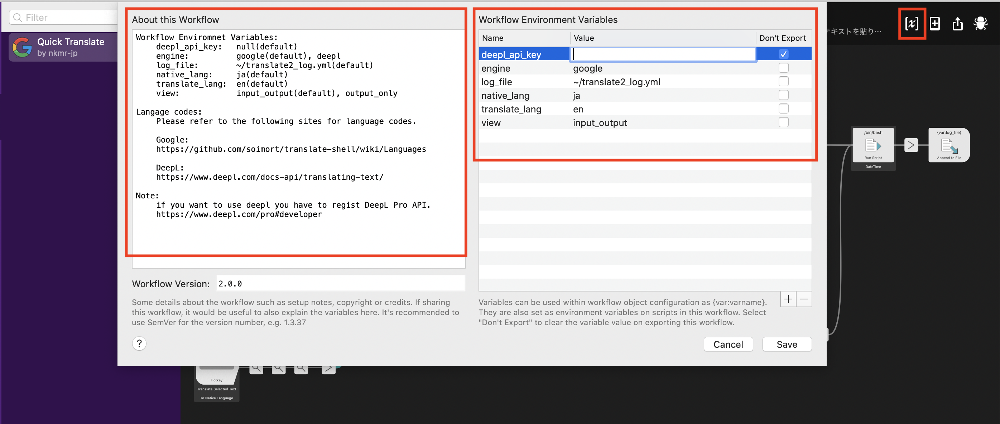
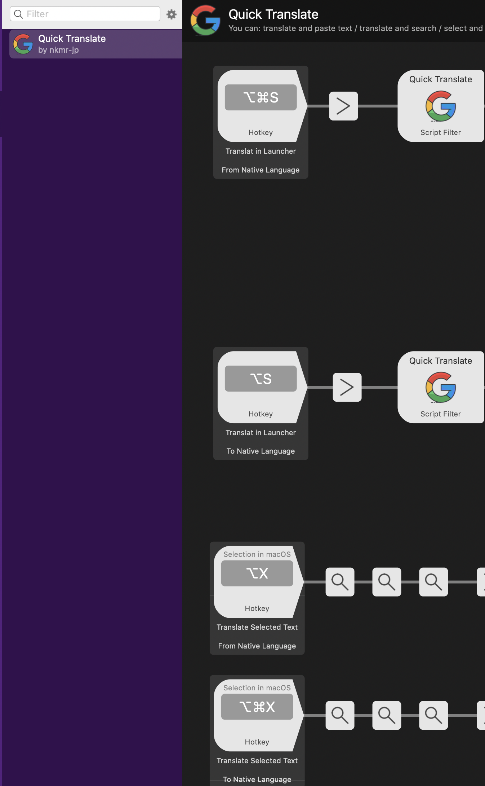

[EN](README.md) | [JA](README_JA.md)

<!-- @import "[TOC]" {cmd="toc" depthFrom=1 depthTo=6 orderedList=false} -->

<!-- code_chunk_output -->

- [Alfred Quick Translate](#alfred-quick-translate)
  - [機能](#機能)
  - [インストール](#インストール)
  - [言語と翻訳エンジンの設定](#言語と翻訳エンジンの設定)
    - [DeepL翻訳を使う場合](#deepl翻訳を使う場合)
  - [Hotkeyの設定](#hotkeyの設定)
  - [使い方](#使い方)
    - [サクッと翻訳したい](#サクッと翻訳したい)
    - [翻訳してGoogleで検索したい](#翻訳してgoogleで検索したい)
    - [テキストを選択して翻訳したい](#テキストを選択して翻訳したい)

<!-- /code_chunk_output -->


# Alfred Quick Translate
- [Alfred 4](https://www.alfredapp.com/) 対応の翻訳ワークフローです。(※有料のPowerpack が必要です。)
- [translate-shell](https://github.com/soimort/translate-shell) を使っています。
- iconは[iconfinder](https://www.iconfinder.com/icons/1249992/google_media_network_search_social_icon#size=128)で探しました。
- 翻訳エンジンを選択できます。
  - Google(デフォルト), DeepL
  - ※ DeepLを使う場合は [DeepL API](https://www.deepl.com/pro#developer) に登録してキーを取得する必要があります。
- 翻訳する言語を選択できるようになりました
  - 言語コード([Google](https://github.com/soimort/translate-shell/wiki/Languages), [DeepL](https://www.deepl.com/docs-api/translating-text/))


## 機能
翻訳してテキストを貼り付け


翻訳してそのまま検索


テキストを選択して翻訳


翻訳したログの自動保存 (`~/translate_log2.yml`)


ログファイルはYamlなのでyqコマンドでパース出来ます。

```sh
$ brew install python-yq
$ cat  ~/translate2_log.yml | yq .
```




クリップボードにも自動で保存<br>
Alfredのクリップボード機能を使うと履歴を検索できるので便利です。



どの機能を使っても、翻訳前、翻訳後のテキストはログファイルとクリップボードの両方に自動で保存されます。

## インストール

1:  [Alfred](https://www.alfredapp.com/) をインストールし、Powerpackを購入してライセンス認証。

2:  各種コマンドをインストール

```shell
brew install translate-shell jq coreutils curl
```

3: [releases](https://github.com/nkmr-jp/alfred-quick-translate/releases)から`quick-translate.alfredworkflow` をダウンロード



4: ダウンロードした `quick-translate.alfredworkflow` をクリックして開くとAlfredが起動するので`import`をクリック。



## 言語と翻訳エンジンの設定
ワークフローをインストール後、右上のアイコンをクリックすると設定画面が開きます。この画面で翻訳エンジンや言語を選択できます。
設定については左側の `About the Workflow` を参考にしてください。



### DeepL翻訳を使う場合
1. [DeepL API](https://www.deepl.com/pro#developer)に登録してのAPIキーを取得してください。
2. `engine`に`deepl`と入力して`deepl_api_key`に取得したキーを入力してください。


## Hotkeyの設定
AlfredのPreferencesのWorkflowsからQuick Translateを開くと、このように各機能のHotkeyが設定できます。<br>
初期の状態ではHotkeyは空白ですのでお好みのキーを割り当てて使ってください。
上から順に

- ランチャーを起動して母国語(native_lang)から翻訳対象言語(translate_lang)に翻訳する（From Native Language)
- ランチャーを起動して翻訳対象言語から母国語に翻訳する（To Native Language)
- 選択したテキストを母国語から翻訳対象言語に翻訳する（From Native Language)
- 選択したテキストを翻訳対象言語から母国語に翻訳する（To Native Language)

となります。




## 使い方
### サクッと翻訳したい
Hotkeyの設定で割り当てたキーで翻訳ランチャーを起動します。<br>
文字を入力するとリアルタイムで翻訳されます。<br>
`Enter` を押すと、翻訳結果をエディタなどに貼り付けられます。


### 翻訳してGoogleで検索したい
Hotkeyの設定で割り当てたキーで翻訳ランチャーを起動します。<br>
翻訳ランチャーでテキストを入力後<br>
`cmd + Enter` で翻訳後のテキストでググれます。


### テキストを選択して翻訳したい

翻訳したいテキストを選択して、Hotkeyに割り当てたキーを入力します。


ブラウザだとGoogle翻訳が使えますが、ソースコード上のコメントやチャットのメッセージなどをすぐ翻訳したいときにも使えて便利です。